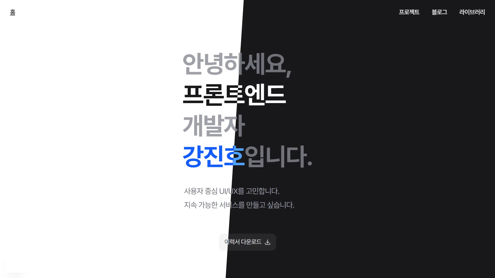

# jinho-blog



<br />

## 📊 CI / Deploy / Coverage

[![CI][badge-ci]][ci-workflow] [![Vercel][badge-deploy]][vercel-deploy]

| Package             | Coverage                                                                                      |
| ------------------- | --------------------------------------------------------------------------------------------- |
| web                 | [![web coverage][badge-cov-web]][codecov-web]                                                 |
| mdx-handler         | [![mdx-handler coverage][badge-cov-mdx-handler]][codecov-mdx-handler]                         |
| nextjs-routes       | [![nextjs-routes coverage][badge-cov-nextjs-routes]][codecov-nextjs-routes]                   |
| thumbnail-generator | [![thumbnail-generator coverage][badge-cov-thumbnail-generator]][codecov-thumbnail-generator] |

<br />

## 💡 소개

블로그&포트폴리오 웹사이트입니다. 포트폴리오, 기술 블로그, 참여 프로젝트 소개, 재사용 가능한 코드 라이브러리를 제공합니다.

- MDX 기반 콘텐츠 렌더링
- 반응형 레이아웃
- 라이트/다크 모드
- RSS 피드, 사이트맵, JSON-LD, 오픈그래프 제공

<br />

## 🛠️ 기술 스택

| 분류           | 기술                                                                           |
| -------------- | ------------------------------------------------------------------------------ |
| 환경           | ![Node.js][badge-nodejs] ![pnpm][badge-pnpm] ![Turborepo][badge-turborepo]     |
| 프레임워크     | ![Next.js][badge-nextjs] ![React][badge-react] ![TypeScript][badge-typescript] |
| UI, 라이브러리 | ![Tailwind CSS][badge-tailwind] ![Zustand][badge-zustand]                      |
| 개발           | ![ESLint][badge-eslint] ![Prettier][badge-prettier]                            |
| 테스트         | ![Vitest][badge-vitest] ![Codecov][badge-codecov]                              |
| AI             | ![Gemini API][badge-gemini]                                                    |
| 배포           | ![Vercel][badge-vercel]                                                        |

<br />

## 🗂️ 프로젝트 구조

```
jinho-blog/
├── apps/
│   └── web/            # Next.js 블로그 앱
├── packages/
│   ├── shared/               # 공유 타입 및 상수
│   ├── thumbnail-generator/  # 썸네일 이미지 생성기
│   ├── mdx-handler/          # MDX 콘텐츠 처리
│   └── nextjs-routes/        # 타입 안전 라우팅 생성기
└── content/
    └── mdx/            # MDX 콘텐츠, 에셋
```

<br />

## 🌐 Web

블로그 메인 애플리케이션으로, 홈페이지와 세 가지 콘텐츠 도메인으로 구성됩니다.

- **홈** - 포트폴리오
- **블로그** — 기술 블로그
- **프로젝트** — 참여 프로젝트 소개
- **라이브러리** — 재사용 가능한 코드 보관
- **번역** — 주요 기술 블로그 한국어 번역 아카이브

<br />

### 🏗️ 아키텍처

[FSD(Feature-Sliced Design)][fsd] 기반 단방향 의존성 레이어 구조입니다. Next.js App Router 환경에서 IDE로 레이어 의존성 방향을 직관적으로 파악할 수 있도록 알파벳 순서로 레이어를 구성했습니다.

```
App (Pages/서버 로직, 레이아웃 중심)
  ↓
Views (Pages/클라이언트 로직, UI 중심)
  ↓
Modules (Widgets)
  ↓
Features
  ↓
Entities
  ↓
Core (App, Shared)
```

| 레이어   | 역할                                                               |
| -------- | ------------------------------------------------------------------ |
| App      | Next.js App Router (라우트, 레이아웃, API 핸들러, 서버 로직)       |
| Views    | 페이지 내에서 재사용 가능한 모듈, 각 페이지를 슬라이스 단위로 관리 |
| Modules  | 재사용 가능한 복합 UI 블록                                         |
| Features | 재사용 가능한 비즈니스 기능 UI                                     |
| Entities | 도메인 서비스 로직                                                 |
| Core     | 전역 상태, 공통 상수 및 타입, UI 컴포넌트, 유틸리티, 훅, 설정      |

<br />

## 📦 Packages

### 🔗 shared

모노레포 전체에서 사용하는 공통 타입과 상수를 보관합니다.

- 블로그·프로젝트·라이브러리 메타데이터 타입
- 카테고리, 정렬 옵션, 에러 타입 등 공통 타입
- 공통 타입에 대응하는 맵 데이터

### 🖼️ thumbnail-generator

satori, @resvg/resvg-js, sharp를 사용해 썸네일 이미지(WebP)를 생성합니다.

- DOM 객체 리터럴(satori) → SVG → PNG(@resvg/resvg-js) → WebP(sharp) 변환

### 📝 mdx-handler

MDX 기반 콘텐츠를 읽고 가공합니다.

- Front-matter를 파싱해 메타데이터 추출
- 카테고리 필터링, 정렬, 페이지네이션 지원
- 빌드 시 `thumbnail-generator`를 통해 블로그 글 썸네일 자동 생성
- Git 또는 GitHub 커밋 기록에서 콘텐츠별 작성일, 수정일 추출
- RSS 피드 기반 기술 블로그 자동 수집 및 Gemini API(gemini-2.5-flash-lite)로 한국어 번역 후 MDX 저장

### 🛣️ nextjs-routes

기존 [nextjs-routes][nextjs-routes-repo] 패키지를 포크해 수정한 타입 안전 라우팅 도구입니다.

- 기존 라이브러리가 지원하지 않던 `next.config.ts` 지원
- Next.js의 API를 변경하지 않고도 라우트 타입 및 유틸리티 함수를 제공하여 Next.js 호환성 개선
- App Router 디렉토리 구조를 분석해 TypeScript 라우트 타입 자동 생성
- 경로 파라미터와 쿼리 파라미터를 타입으로 관리해 런타임 오류 방지

<br />

## 🚀 CI/CD

- **CI** — PR 생성 → GitHub Actions 전체 테스트 실행 후 Codecov 업로드 & Vercel 빌드 및 배포 → 성공 시 PR 병합 가능
- **CD** — `main`에 변경사항 병합 → Vercel 자동 배포
- **번역 콘텐츠 자동화** — 매일 UTC 02:00 GitHub Actions 실행 → RSS 피드 신규 글 감지 → Gemini API로 처리 → `mdx` 브랜치에 자동 커밋

  | 소스                                                                                                                                | 라이선스            | 처리 방식 |
  | ----------------------------------------------------------------------------------------------------------------------------------- | ------------------- | --------- |
  | React Blog                                                                                                                          | CC BY 4.0           | 전문 번역 |
  | Chrome Developers                                                                                                                   | CC BY 4.0           | 전문 번역 |
  | web.dev                                                                                                                             | CC BY 4.0           | 전문 번역 |
  | V8 Blog                                                                                                                             | CC BY 3.0           | 전문 번역 |
  | Next.js Blog, Vercel Blog, TypeScript Blog, Tailwind CSS Blog, TanStack Blog, Anthropic Engineering, Claude Blog, OpenAI Developers | All rights reserved | 핵심 요약 |

<br />

## ✍️ 콘텐츠 작성

`content/mdx/` 아래 `blog/`, `projects/`, `libraries/` 폴더에 MDX 파일을 추가해 콘텐츠를 게시할 수 있습니다.

- mdx-handler 패키지를 통해 빌드 시 web에 에셋과 문서를 등록
- MDX 파일 이름이 페이지 슬러그로 매칭
- MDX 파일 Front-matter에 메타데이터 작성
- `translate/` 폴더 GitHub Actions가 RSS 피드에서 자동 번역·생성

<br />

<!-- Links -->

[fsd]: https://feature-sliced.design
[nextjs-routes-repo]: https://github.com/tatethurston/nextjs-routes
[ci-workflow]: https://github.com/jinhok96/jinho-blog/actions/workflows/ci.yml
[vercel-deploy]: https://github.com/jinhok96/jinho-blog/deployments/Production

<!-- Coverage badges -->

[badge-cov-web]: https://codecov.io/gh/jinhok96/jinho-blog/graph/badge.svg?flag=web
[badge-cov-nextjs-routes]: https://codecov.io/gh/jinhok96/jinho-blog/graph/badge.svg?flag=nextjs-routes
[badge-cov-mdx-handler]: https://codecov.io/gh/jinhok96/jinho-blog/graph/badge.svg?flag=mdx-handler
[badge-cov-thumbnail-generator]: https://codecov.io/gh/jinhok96/jinho-blog/graph/badge.svg?flag=thumbnail-generator
[codecov-web]: https://app.codecov.io/gh/jinhok96/jinho-blog/tree/main?flags%5B0%5D=web
[codecov-nextjs-routes]: https://app.codecov.io/gh/jinhok96/jinho-blog/tree/main?flags%5B0%5D=nextjs-routes
[codecov-mdx-handler]: https://app.codecov.io/gh/jinhok96/jinho-blog/tree/main?flags%5B0%5D=mdx-handler
[codecov-thumbnail-generator]: https://app.codecov.io/gh/jinhok96/jinho-blog/tree/main?flags%5B0%5D=thumbnail-generator

<!-- CI/CD badges -->

[badge-ci]: https://github.com/jinhok96/jinho-blog/actions/workflows/ci.yml/badge.svg
[badge-deploy]: https://img.shields.io/github/deployments/jinhok96/jinho-blog/Production?label=vercel&logo=vercel&logoColor=white&color=000000

<!-- Tech stack badges -->

[badge-nodejs]: https://img.shields.io/badge/Node.js_24-339933?style=flat&logo=nodedotjs&logoColor=white
[badge-pnpm]: https://img.shields.io/badge/pnpm_10-F69220?style=flat&logo=pnpm&logoColor=white
[badge-nextjs]: https://img.shields.io/badge/Next.js_16-000000?style=flat&logo=nextdotjs&logoColor=white
[badge-react]: https://img.shields.io/badge/React_19-61DAFB?style=flat&logo=react&logoColor=black
[badge-typescript]: https://img.shields.io/badge/TypeScript_5-3178C6?style=flat&logo=typescript&logoColor=white
[badge-tailwind]: https://img.shields.io/badge/Tailwind_CSS_4-06B6D4?style=flat&logo=tailwindcss&logoColor=white
[badge-zustand]: https://img.shields.io/badge/Zustand_5-443E38?style=flat&logo=zustand&logoColor=white
[badge-turborepo]: https://img.shields.io/badge/Turborepo-EF4444?style=flat&logo=turborepo&logoColor=white
[badge-eslint]: https://img.shields.io/badge/ESLint_9-4B32C3?style=flat&logo=eslint&logoColor=white
[badge-prettier]: https://img.shields.io/badge/Prettier_3-F7B93E?style=flat&logo=prettier&logoColor=black
[badge-vitest]: https://img.shields.io/badge/Vitest-6E9F18?style=flat&logo=vitest&logoColor=white
[badge-codecov]: https://img.shields.io/badge/Codecov-F01F7A?style=flat&logo=codecov&logoColor=white
[badge-gemini]: https://img.shields.io/badge/Gemini_API-8E75B2?style=flat&logo=googlegemini&logoColor=white
[badge-vercel]: https://img.shields.io/badge/Vercel-000000?style=flat&logo=vercel&logoColor=white
