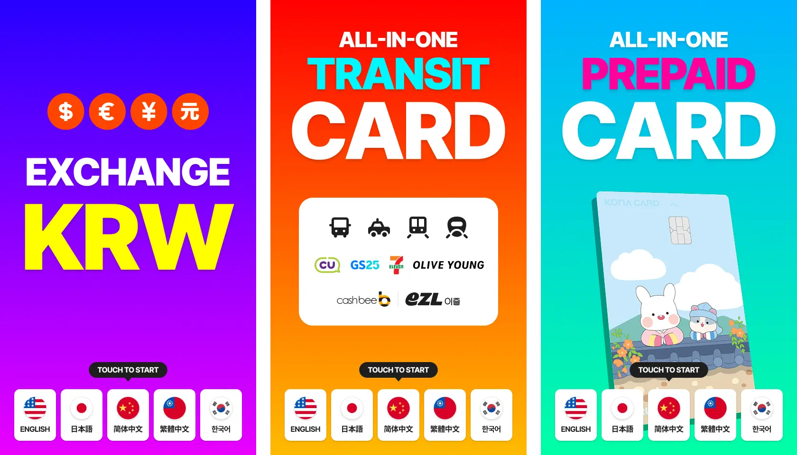

키오스크 앱에서 비활동 상태를 감지해 자동으로 표시하는 스플래시 화면을 디자인·구현했으며, 주간 평균 거래 건수가 50.8% 상승했습니다.

# 상세 내용

## 1. 기능 구현

- 스플래시 화면 3종류 디자인 (환전, 교통카드, 선불카드 홍보 이미지)
- 홈 화면으로 이동하거나 홈 화면에서 30초 비활동 감지 시 자동 표시
- 스플래시 이미지 10초 간격 슬라이드
- 하단 5개 언어(한국어, 영어, 일본어, 중국어 간체/번체) 선택 버튼

## 2. 성능 최적화

- 컴포넌트 언마운트 시 타이머를 정리해 메모리 누수 방지
