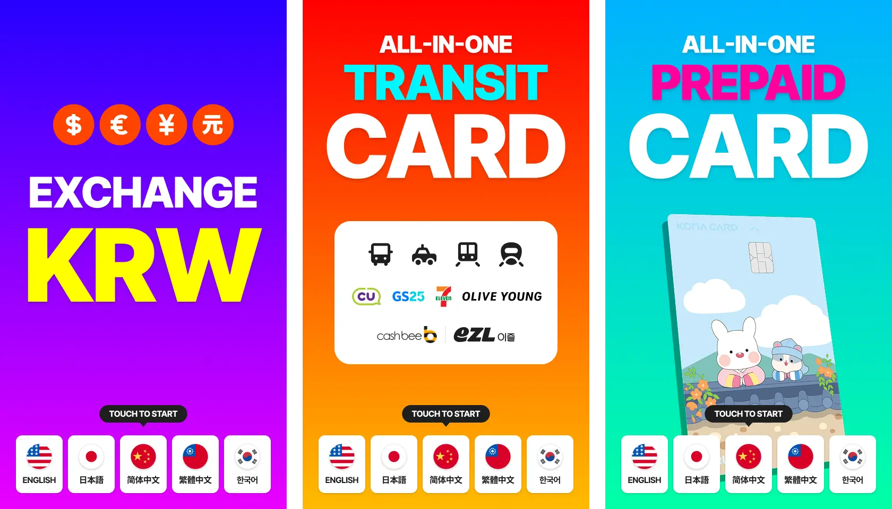

키오스크 앱에서 비활동 상태를 감지해 자동으로 표시하는 스플래시 화면을 기획·디자인·구현했으며, 주간 평균 거래 건수가 50.8% 상승했습니다.

# 상세 내용

## 1. 문제 인식 및 기획

- 현장 직원 관찰 보고를 바탕으로, 이용객이 키오스크 존재와 서비스를 인지하지 못해 그냥 지나친다는 원인 파악
- 추가 비용 없이 가장 빠르게 적용 가능한 방향으로 스플래시 화면을 직접 기획·디자인·구현
- 3m 밖에서도 인지 가능한 고채도·고대비 이미지와 서비스 소개 텍스트, 타 키오스크 서비스 벤치마킹 반영

## 2. 기능 구현

- 스플래시 화면 3종류 디자인 (환전, 교통카드, 선불카드 홍보 이미지)
- 홈 화면으로 이동하거나 홈 화면에서 30초 비활동 감지 시 자동 표시
- 스플래시 이미지 10초 간격 슬라이드
- 하단 5개 언어(한국어, 영어, 일본어, 중국어 간체/번체) 선택 버튼

## 3. 성능 최적화

- 컴포넌트 언마운트 시 타이머를 정리해 메모리 누수 방지
